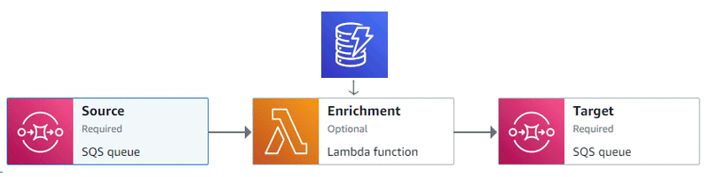

Sample implementation of the [Content Enricher](https://www.enterpriseintegrationpatterns.com/patterns/messaging/DataEnricher.html) pattern with Amazon EventBridge Pipes, Lambda (Python), and DynamoDB. 

To run this example, you'll need an AWS account. Follow the instructions on the [pattern page](https://www.enterpriseintegrationpatterns.com/patterns/messaging/DataEnricher.html#example2). Note that deploying this example might incur a cost. Don't forget to delete the resources when you're done.
